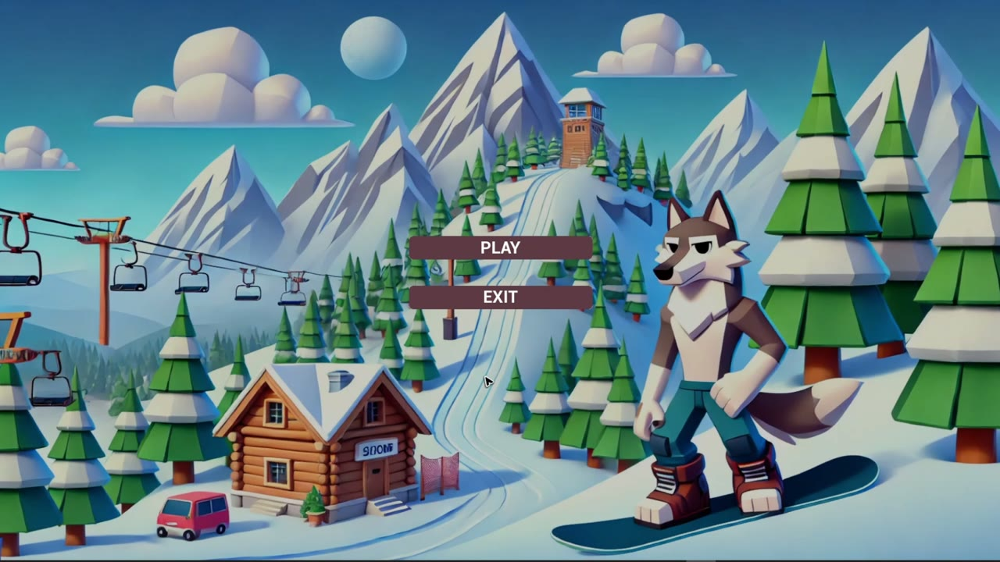
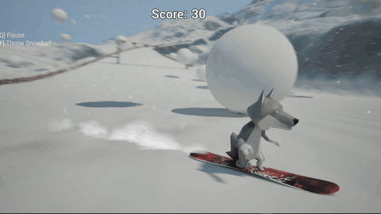
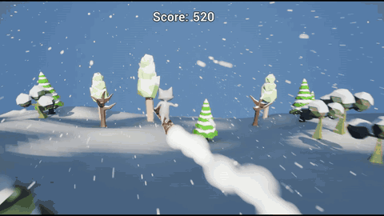
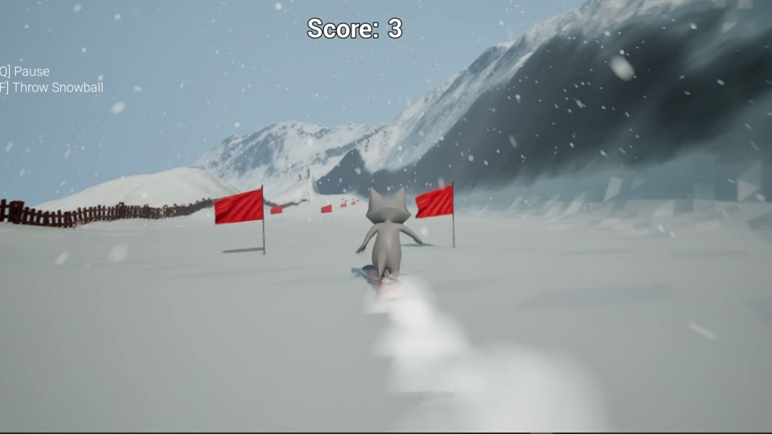
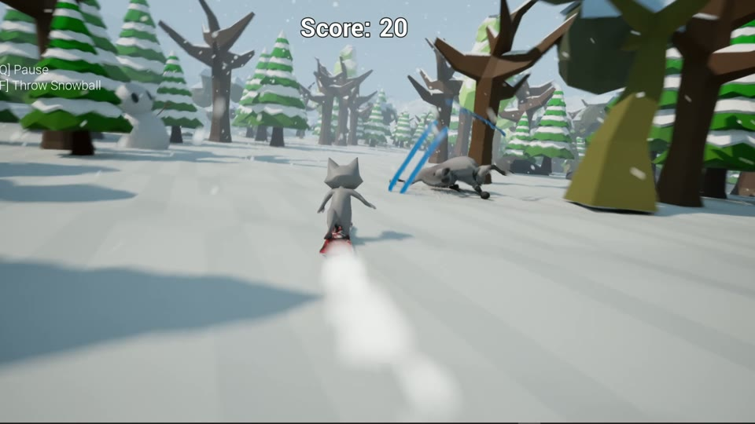

# Snowboard Mayhem

An arcade snowboarding game, built solo in Unreal Engine 5 with C++ and Blueprints. It was my first Unreal project, made for the Saxion Minor *Skilled* (Feb–Jul 2024) to move from Unity to Unreal. Six months later I reopened it and rebuilt the run around endlessly generating terrain.

<table>
<tr>
<td width="50%" align="center"> <b>Original</b>: the snowball avalanche finale</td>
<td width="50%" align="center"> <b>Extended Edition</b>: terrain that generates ahead of the rider</td>
</tr>
<tr>
<td width="50%" align="center"> Flag gates that score and turn green on pass-through</td>
<td width="50%" align="center"> PCG forest, skiers and obstacles on the run</td>
</tr>
</table>

▸ **Watch:** [Original playthrough](https://youtu.be/_D_ThHoAFRc) · [Extended Edition](https://youtu.be/SMM9qwed8VA)

## What I built

- **Snowboard movement in C++**: a character and movement component that read the slope under the board with line traces to drive speed and direction and to align the board with the terrain.
- **Blueprint first, C++ second**: mechanics were prototyped in Blueprints, then the gameplay-critical ones were ported to C++ and exposed back to Blueprints for tuning.
- **Gameplay systems**: flag gates, an avalanche manager with growing snowballs, a finish line, and a persistent high score.
- **Procedural environment**: a PCG forest and spline-based object spawning with varied size, density and orientation. In the Extended Edition, noise-driven terrain chunks generate ahead of the rider.
- **Look and feel**: low-poly snow materials and shaders, Niagara snow trails, fog and lighting, the main menu, HUD, pause menu and loading screen, and the music and sound mix.
- **QA**: four evaluation rounds, each recorded with the change it led to.

## Code map

| Class | Role |
|---|---|
| `ASnowboarder` | Player character: velocity, slope alignment, debug drawing |
| `USnowboardMovement` | Movement component: line-trace slope reading and board alignment |
| `AFlags` | Gate pairs that score once and change material on pass-through |
| `AAvalancheManager`, `AGrowingSnowball` | The avalanche event and its growing snowballs |
| `UHighScoreManager` | Saved high score, exposed to Blueprints |
| `AFinishLine` | End of the run |
| `APCGForest`, `ASpawnObjectAlongSpline` | Procedural placement of trees, fences and props |

| `ALandscapePCG`, `AChunk` | Extended Edition: noise-driven terrain chunks generated ahead of the rider |

Source lives in [`Source/MinorSkilled`](Source/MinorSkilled).

## Opening the project

- Unreal Engine 5.3, with Git LFS installed before cloning (all of `Content/` is stored in LFS)
- The Extended Edition terrain uses two marketplace plugins: **Perlin Noise** (by Alex R) and **FastNoiseGenerator**. Install both from Fab before opening the project.

<!-- TODO(owner): One terrain chunk class follows a public tutorial. Credit it here,
     e.g. "Terrain chunks adapted from <tutorial and link>." -->

## Built with

`Unreal Engine 5.3` `C++` `Blueprints` `PCG` `Niagara` `Git LFS`

Solo project. A designer friend gave input at the concept stage.
